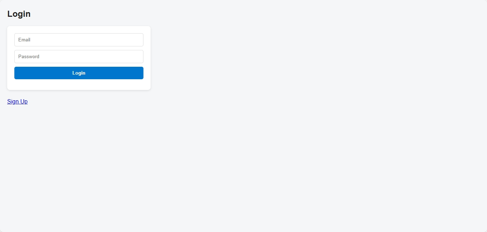
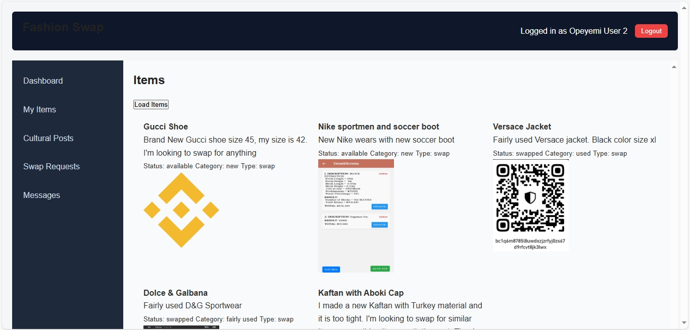
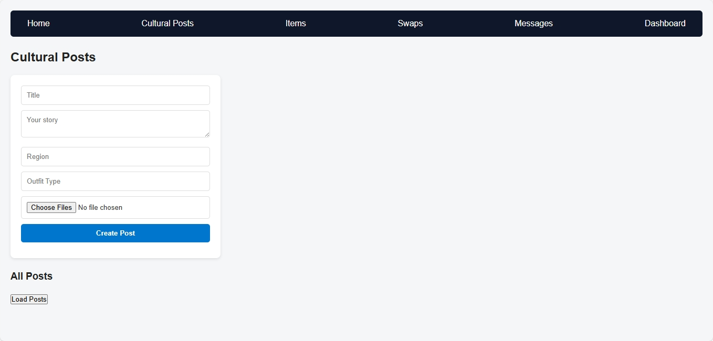

# 👗 Fashion Swap Platform

A full-stack application where users can **swap, sell, or donate fashion items**, share **cultural posts**, comment, and chat with each other.  
Built with **Node.js + Express + Sequelize (PostgreSQL)** on the backend and **HTML/CSS/JavaScript (with Axios)** on the frontend.

---

## 🚀 Features
- 🔐 **Authentication & Authorization**
  - User registration with profile picture (avatar)
  - Login with JWT-based authentication
  - Protected routes (only logged-in users can create items, posts, swaps, etc.)

- 👗 **Items**
  - Add, update, delete fashion items
  - Status: `available`, `swapped`, `removed`
  - Upload multiple item photos

- 🔄 **Swap Requests**
  - Send swap requests from one item to another
  - Accept / Decline / Complete swaps

- 📝 **Cultural Posts**
  - Create and view posts about fashion & culture
  - Comment system for engagement

- 💬 **Messaging**
  - Send and receive messages between users

- 📊 **Dashboard**
  - User profile info
  - User items
  - Swap requests
  - Messages

---

## 🛠️ Tech Stack
- **Backend:** Node.js, Express, Sequelize ORM, PostgreSQL
- **Frontend:** HTML, CSS, JavaScript, Axios (or Vue.js optional)
- **Auth:** JWT (JSON Web Token) + bcrypt for password hashing
- **File Uploads:** Multer for handling images
- **Testing:** Jest + Supertest
- **Dev Tools:** Nodemon, Vite (for Vue version)

---

## 📂 Project Structure
fashion_swap/
│── src/
│ ├── config/ # Database config
│ ├── controllers/ # Route controllers (auth, items, swaps, etc.)
│ ├── models/ # Sequelize models
│ ├── routes/ # API endpoints
│ ├── middleware/ # Auth middleware (JWT)
│ └── server.js # Express app entry point
│
│── frontend/ # HTML/CSS/JS frontend
│ ├── login.html
│ ├── signup.html
│ ├── dashboard.html
│ ├── culturalPosts.html
│ ├── items.html
│ └── main.js # Axios calls to backend
│
│── tests/ # Jest + Supertest files
│── migrations/ # Sequelize migrations
│── package.json
│── README.md


---

## ⚙️ Installation & Setup

### 1️⃣ Clone repo
```bash
git clone https://github.com/yourusername/fashion-swap.git
cd fashion-swap

2️⃣ Install backend dependencies
cd backend
npm install

3️⃣ Setup environment variables

Create .env file in backend/:

PORT=8000
DB_HOST=localhost
DB_USER=postgres
DB_PASS=yourpassword
DB_NAME=fashion_swap
JWT_SECRET=your_secret_key

4️⃣ Run migrations
npx sequelize-cli db:migrate

5️⃣ Start backend server
npm run dev

6️⃣ Start frontend

Open frontend/index.html in your browser, or run a simple server:

npx serve frontend

🧪 Running Tests
npm test

📌 API Routes (Quick Reference)
Auth

POST /api/auth/register → Register user

POST /api/auth/login → Login

GET /api/auth/profile → Get logged-in user

Items

POST /api/items/create → Create new item

GET /api/items → Get all items

PUT /api/items/:id → Update item

DELETE /api/items/:id → Delete item

Swap Requests

POST /api/swaps/create → Create swap request

GET /api/swaps/mine → Get user swaps

PUT /api/swaps/:id/accept → Accept swap

PUT /api/swaps/:id/decline → Decline swap

Cultural Posts

POST /api/post/create → Create post

GET /api/post → List posts

POST /api/post/:id/comment → Add comment

Messages

POST /api/messages/send → Send message

GET /api/messages/inbox → User inbox

## 📸 Screenshots

### Login Page


### Dashboard


### Dashboard


### Dashboard


### Dashboard



📜 License

MIT License © 2025 [Peter]