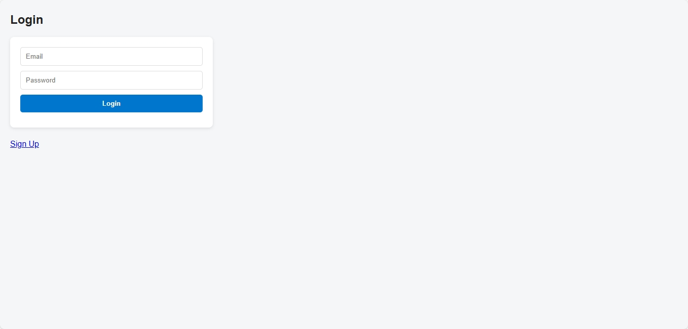
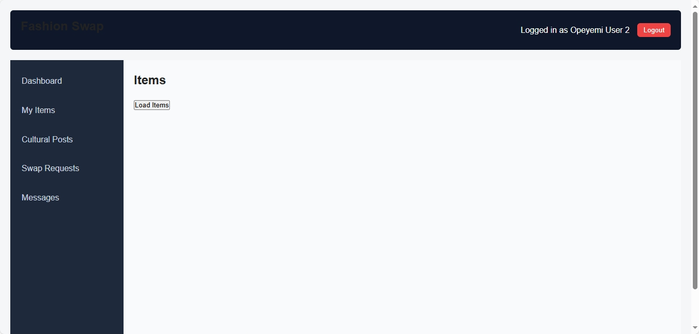
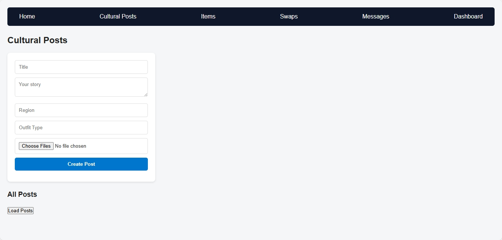

# 👗 Fashion Swap Platform

A full-stack web application for swapping, selling, and donating fashion items.  
It also allows users to create cultural posts, comment, send messages, and manage swap requests.

---

## ✨ Features
- 🔐 User Authentication (JWT + bcrypt)
- 👤 Profile with avatar upload
- 🛍️ Manage Fashion Items (create, update, delete, list)
- 🔄 Swap Requests between users
- 📝 Cultural Posts with comments
- 💬 Messaging system (inbox & sent)
- 📊 Admin-only actions (delete posts, manage users)
- 🖥️ User Dashboard

---

## 📸 Screenshots

> Screenshots are stored in the `./screenshots/` folder. Replace the sample placeholders with your real app screenshots.

### 🔑 Login Page


### 🏠 Dashboard


### 👗 Cultural Posts


---

## ⚙️ Tech Stack
- **Backend:** Node.js, Express, Sequelize, PostgreSQL  
- **Frontend:** HTML, CSS, JavaScript (axios/fetch integration)  
- **Authentication:** JWT + bcrypt  
- **File Uploads:** Multer  
- **Testing:** Jest + Supertest  

---

## 🚀 Getting Started

### 🔹 Backend Setup
```bash
# Clone the repo
git clone https://github.com/eesuola/fashion-swap.git

cd fashion-swap

# Install dependencies
npm install

# Setup environment variables
cp .env.example .env

# Run database migrations
npx sequelize-cli db:migrate

# Start server
npm run dev
````

### 🔹 Frontend Setup

Since the frontend is plain HTML/CSS/JS:

1. Open `index.html` in your browser
2. Or run it with VS Code’s **Live Server** extension
3. Ensure the backend (`http://localhost:8000`) is running

---

## 📡 API Routes Overview

### 🔑 Authentication

* `POST /api/auth/register` → Register new user
* `POST /api/auth/login` → Login user

### 🔑 User

* `GET /api/users/:id` → Fetch user by ID
* `GET /api/users/` → Fetch All User
* `PUT /api/users/update` → Update User Details
* `DELETE /api/users/:/` → Delete User

### 👗 Items

* `POST /api/items/create` → Create item
* `GET /api/items` → Get all items
* `GET /api/items/:id` → Get item by ID
* `PUT /api/items/update/:id` → Update item by ID
* `DELETE /api/items/delete/` → Delete item
* `DELETE /api/items/:id` → Delete item by ID

### 🔄 Swaps

* `POST /api/swaps/create` → Send swap request
* `GET /api/swaps/` → Get user’s swaps
* `PUT /api/swaps/:id/respond` → Get user’s swaps
* `PUT /api/swaps/:id/complete` → Get user’s swaps

### 📝 Cultural Posts and Comments

* `POST /api/post/create` → Create cultural post
* `GET /api/post` → List all posts
* `GET /api/post/:id` → Get post details
* `PUT /api/post/:id` → Edit post
* `DELETE /api/post/deleteAll` → Delete All Post
* `DELETE /api/post/:id` → Delete All Post
* `POST /api/post/:id/comments` → Add comment to a post
* `GET /api/post/:id/comments` → Get comment from a post
* `DELETE /api/post/:id/comments/:commentId` → Delete comment from a post

### 💬 Messages

* `POST /api/messages/send` → Send message
* `GET /api/messages/inbox` → Get inbox messages

---

## 🧪 Testing

We use **Jest + Supertest**.

Run all tests:

```bash
npm test
```

Example test file:

* `tests/user.test.js` → Auth tests
* `tests/post.test.js` → Cultural post tests

---

## 🤝 Contributing

1. Fork the project
2. Create your feature branch (`git checkout -b feature/newFeature`)
3. Commit your changes (`git commit -m 'Add newFeature'`)
4. Push to the branch (`git push origin feature/newFeature`)
5. Open a Pull Request

---

## 📜 License

This project is licensed under the MIT License.

---

## 👨‍💻 Author

Built with ❤️ by [Peter](https://github.com/eesuola)

```


---
